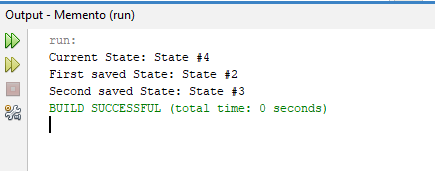

# Memento

O **Memento** é um padrão de projeto comportamental que permite salvar e restaurar o estado interno de um objeto, sem violar seu encapsulamento. Em outras palavras, ele permite "tirar um print" do estado atual de um objeto, para que você possa voltar a ele posteriormente, se necessário.

## Componentes
O Memento trabalha com três atores principais:

- **Originator**: O objeto que deseja salvar seu estado. Possui métodos para criar e restaurar o Memento.
- **Memento**: Um objeto que armazena o estado do Originator. Ele é imutável, ou seja, seu estado não pode ser modificado após a criação. Contém o estado do Originator geralmente como atributos privados, e métodos de acesso a esses atributos.
- **Caretaker**: Mantém uma coleção de Mementos, garantindo que o histórico do estado do Originator seja preservado e recuperável.

## Princípios Essenciais

- **Encapsulamento**: O Memento mantém o estado interno do Originator encapsulado, evitando que o Caretaker tenha acesso direto às variáveis internas do Originator.
- **Imutabilidade**: O Memento é imutável, garantindo que seu estado não seja alterado após sua criação, preservando a consistência do estado do Originator.
- **Controle de Acesso**: O Originator é o único objeto que pode modificar o Memento, garantindo o controle sobre o estado do objeto.

## Para que serve?

O padrão Memento é útil em situações onde:

- **Desfazer/Refazer**: Permitir que o usuário desfaça e refaça operações, como em editores de texto ou programas de desenho.
- **Histórico**: Manter um histórico de estados de um objeto, permitindo que ele volte para um estado anterior.
- **Persistência**: Salvar o estado de um objeto em um arquivo ou banco de dados.

## Exemplos de Aplicação

- **Editor de texto**: Salvar o estado do texto atual (conteúdo, formatação, cursor), para que o usuário possa desfazer/refazer operações.
- **Jogo**: Salvar o estado do jogo (posição dos jogadores, itens, pontuação) para que o jogador possa carregar um save game.
- **Editor de imagens**: Salvar o estado da imagem (camadas, filtros, modificações) para que o usuário possa voltar a uma versão anterior.
- **Configurações**: Salvar as configurações de um aplicativo para que o usuário possa restaurar suas preferências.

## Quando usar o padrão de design Memento?
Normalmente, o Memento Design Pattern será usado em situações em que algumas ações são desfazíveis, exigindo, portanto, o rollback para um estado anterior. No entanto, se o estado do Originator for pesado, usar o Memento Design Pattern pode levar a um processo de criação caro e ao aumento do uso de memória.

## Diferenças
# Versão com Memento:
- **Encapsulamento:** O Memento encapsula o estado do Originator, ocultando os detalhes internos.
- **Imutabilidade:** O Memento é um objeto imutável, o que garante que o estado salvo não seja modificado acidentalmente.
- **Desacoplamento:** O Originator não depende de como os Mementos são armazenados ou gerenciados.
- **Flexibilidade:** O Memento permite diferentes estratégias de armazenamento e recuperação de estados (por exemplo, usando um Caretaker ou um histórico de versões).

# Versão sem Memento:
- **Sem encapsulamento**: O estado do Originator é armazenado diretamente em uma lista, expondo os detalhes da implementação.
- **Estado mutável:** A lista de estados salvos é mutável, o que pode levar a modificações acidentais do estado salvo.
- **Dependente da implementação:** O Originator depende da lista de estados salvos, o que dificulta a alteração do mecanismo de armazenamento.
- **Menos flexível:** O mecanismo de armazenamento é mais rígido, limitado à lista interna.

## Output

